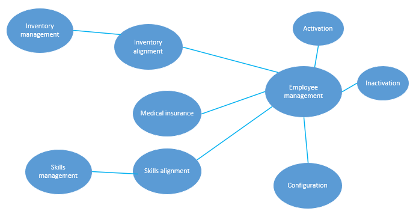
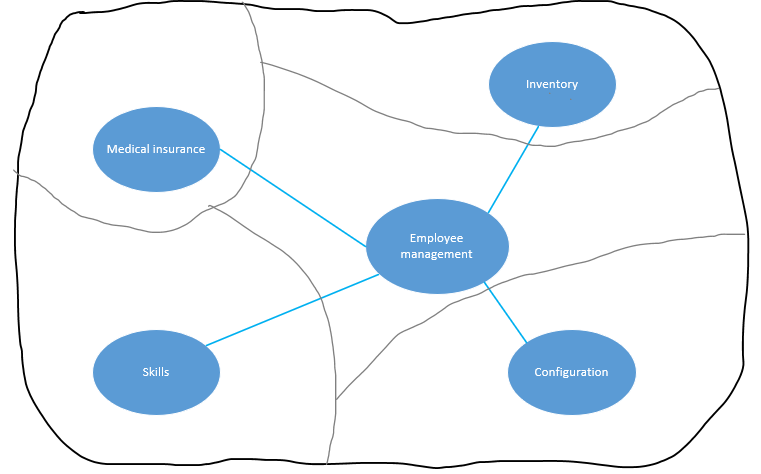
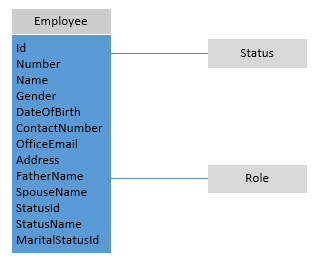
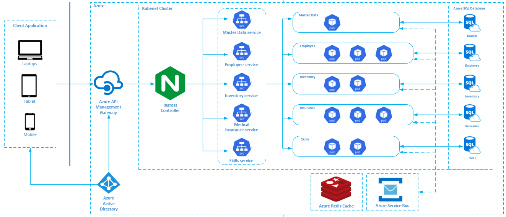

# Planning and Solutioning Microservices using Domain Driven Design #

## Introduction ##

 

This article is the first part of series covering planning, solutioning, designing, developing, deploying and protecting Microservices deployed to Azure Kubernetes Services -

 

- Planning and Solutioning Microservices using Domain Driven Design
- [Developing Microservices using .Net 5](https://github.com/AmanpreetSingh-GitHub/Developing-Microservices-using-.Net-5)
- [Deploying-Microservices to Azure Kubernetes Services](https://github.com/AmanpreetSingh-GitHub/Deploying-Microservices-to-Azure-Kubernetes-Services)
- Inter Microservices communication using Azure Service Bus
- Using Redis cache to increase performance during inter Microservices communicaiton
- Protecting Microservices inside Azure Kubernetes Services using Azure API Management
- Authenticate Microservices inside Azure Kubernetes Services using Azure Active Directory

 

This article covers following things –
- Domain-driven approach to designing microservices
- Description of our case study
- Analyze the business domain of our case study to get an informal description of our domain
- Identify the bounded contexts in our domain
- Apply tactical domain-driven design patterns to the bounded context to define the entities, aggregates and domain services
- Identify the microservices for our case study based on the last step
- Design the microservices architecture

 

## Domain-driven approach to designing microservices ##

 

We need to have loose coupling with high cohesion while designing microservices, and our microservices should be designed around business capabilities. Domain-driven design helps us in designing microservices that are loosely coupled, having high functional cohesion with proper encapsulation. Following domain-driven design helps us in designing the microservices in a way that each microservice fits to a functional business requirement.

There are two phases in domain-driven design -
- Strategic
    - Here we  define the large scale structure of the system. This phase ensures that our architectures focuses on functional business capabilities
- Tactical
    - This phase provide design patterns like entities, aggregates, domain services that help in the creation of domain model. These patterns help design loosely coupled and highly choesive microservices

We will follow four step process and apply them to our case study to identify the microservices -
- Analyze the business domain of our case study to get an informal description of our domain
- Identify the bounded context in our domain
- Apply tactical domain-driven design patterns to the bounded context to define the entities, aggregates and domain services
- Identify the microservices for our case study based on the last step

 

## Case Study ##

 

XYZ company has grown its operations from being a startup to a mid-sized company with an estimated revenue of 40 million USD. Most of the workloads around employee management <i> like  employee data management, skills inventory and alignment, medical insurance, hardware inventory and assignment</i> were done using multiple excel spreadsheets. With growing employee base managing everything in excel spreadsheets is time consuming and error prone that also leads to multiple copies of redundant information.

XYZ leadership decided to invest in some human resources tool that will not only manage the immediate needs to managing employee data but also can be expanded in future to include demand and supply, staffing, policies and processes, and performance review process.

XYZ had two options - either go with off the shelf human resource tool from the market or develop an in-house custom application. Based on the internal approvals and cost effectiveness (details not included as being not relevant to the article), XYZ leadership decided to go ahead with internal development of custom application.

XYZ's over arching goal is the Digitization of all their manual workloads. With establishing the basic functionality currently, XYZ wants to add new functionalities iteratively. The application should be able to auto scale as per the load that would vary rapidly. All these requirements lead the Digital team to choose microservices architecture for their human resource application.

 

## Analyze the business domain ##

 

As a first step we will map the functions in our business domain and the connections between those functions. Along the way we will also identify discrete subdomains.

Based on the human resource domain and current scope of the application, below diagram depicts the domain -

 

 

- <b>Employee management</b>, this is at the core of business as the main purpose of human resource tool is to enable efficient employee management
    - <b>Activation</b> and <b>Inactivation</b> of employees are closely related functionalities to Employee management
- <b>Medical insurance</b>, identifies functionality related to managing medical insurance data of employees
- <b>Skills alignment</b>, identifies functionality related to skills mapping of employees
    - <b>Skills managment</b> is closely related functionality to Skills alignment
- <b>Inventory alignment</b>, identifies functionality related to hardware resources mapping of employees
    - <b>Inventory managment</b> is closely related functionality to Inventory alignment
- <b>Configuration</b>, this is the subdomain that supports the business

 

## Define bounded context ##

 

We will now identify the bounded contexts which is the boundary within a domain. It is these bounded context that a particular domain model applies.

 

 

## Using tactical DDD to design microservices ##

 

We will identify the scenarios that each bounded context will handle.

As we will be only targetting the <i>Employee Management</i> bounded context initially, we will identify the scenarios that <i>Employee Management</i> bounded context will handle -

- Adding new employee when he joins XYZ
- Adding his user and role in User and Role management system
- Set his status as Active in the system
- Show him his basic employment details
- Let him update his basic employment details
- Set the employee Inactive when he leaves XYZ

Based on the scenarios, we have identified below entities -

- Employee
- Status
- Role

Below is the UML diagram of Employee aggregate with references to Status and Role aggregates -

 

There is one domain event -
- Employee entity sends FetchStatusDetails event to fetch details of the status

 

## Identifying microservice boundaries ##

 

Based on our analysis, we have identified three aggregates - 
- Employee
- Status
- Role

We define that Employee and Status are direct candidates for microservices, where Status will be part of MasterData microservice that will take care all the master data for Employee microservice. As we have already identified the use of Azure Active Directory for user and role management, we will not be creating a separate microservice for Role, but rather use Azure Active Directory Services.

So we have identified two microservices -

- Employee
- MasterData

 

## Designing the microservices architecture ##

 

Based on our modeling that we did using domain-driven design, below is the solution architecture for our human resource case study. The implementation run on Kubernetes using Azure Kubernetes Service (AKS).

 

 

There are various components of the solution architecture. Below is the detailed explanation of each component -

- <b>Client Application</b>
    - This will be the front-end UI component of the solution, probably developed in some client-side framework like Angular
    - Client application will use Azure Active Directory for authentication that will be used for user and role management
    - Client application will talk to the backend services using Azure API Management Service by passing the JWT token for authorization
- <b>Azure API Manageent Gateway</b>
    - We will use Azure API Management to keep all our APIs behind a single domain and protect our backend microservices
    - This will also help modify the shape and behaviour of our APIs using policies. We will use policies to only pass through the authorized client requests by validating the JWT tokens from client requests
- <b>Kubernetes Cluster</b>
    - We will use Azure Kubernetes Services to deploy and run our microservices. Below are the details of each internal component of Azure Kubernetes Services
- <b>Ingress Controller</b>
    - Ingress Controller acts as all-in-one Load Balancer, Cache, API Gateway, and WAF for our Kubernetes environment
    - All the authorized client requests that are passed through the Azure API Management Gateway are directed to this Ingress Controller
- <b>ClusterIP Services</b>
    - Services are used to logically group together set of pods so as to provide network connectivity to the workloads
    - ClusterIP services are good for internal connectivity between workloads
    - We will have multiple ClusterIP services each for the microservice type - Employee, MasterData, Skills, Inventory, Medical Insurance
- <b>Pods</b>
    - This is where our application workloads are deployed and run on the containers
    - We will have application workload for each of our microservice - Employee, MasterData, Skills, Inventory, Medical Insurance
    - Pods will autoscale depending on CPU utilization
- <b>Azure SQL Database</b>
    - Each microservice will have its own data source
- <b>Azure Service Bus</b>
    - We will use Azure Service Bus for reliable cloud messaging as a service (MaaS) that will be used for inter microservices communication
- <b>Azure Redis Cache</b>
    - We will use Azure Redis Cache to store data so as to avoid expensive inter microsrvices communication

 

## Next Steps ##

 

Please follow other articles in this series that talks about implementation, deployment and protecting the microservices.

 

## References ##

- [Using domain analysis to model microservices](https://docs.microsoft.com/en-us/azure/architecture/microservices/model/domain-analysis)
- [Using tactical DDD to design microservices](https://docs.microsoft.com/en-us/azure/architecture/microservices/model/tactical-ddd)
- [Identifying microservice boundaries](https://docs.microsoft.com/en-us/azure/architecture/microservices/model/microservice-boundaries)
- [Designing a microservices architecture](https://docs.microsoft.com/en-us/azure/architecture/microservices/design/)
